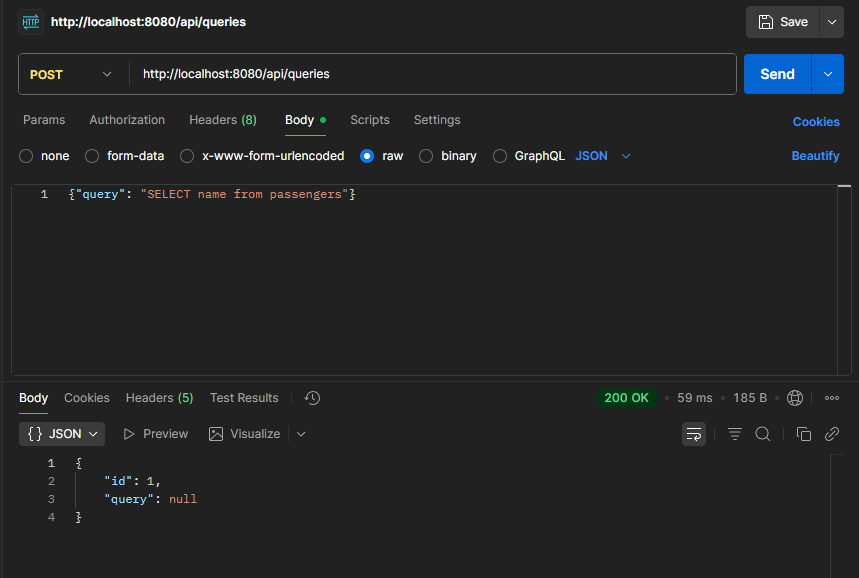
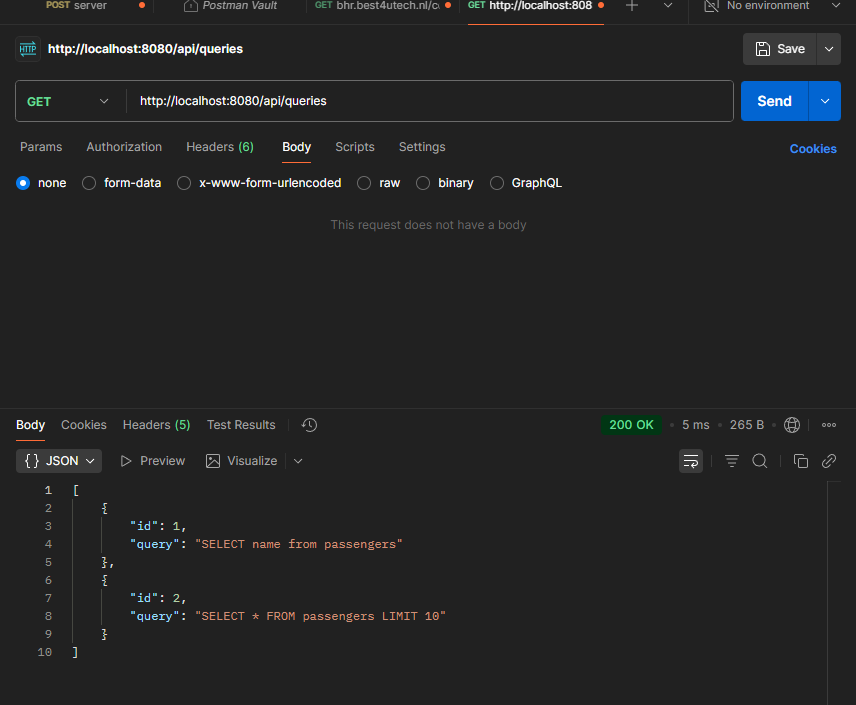
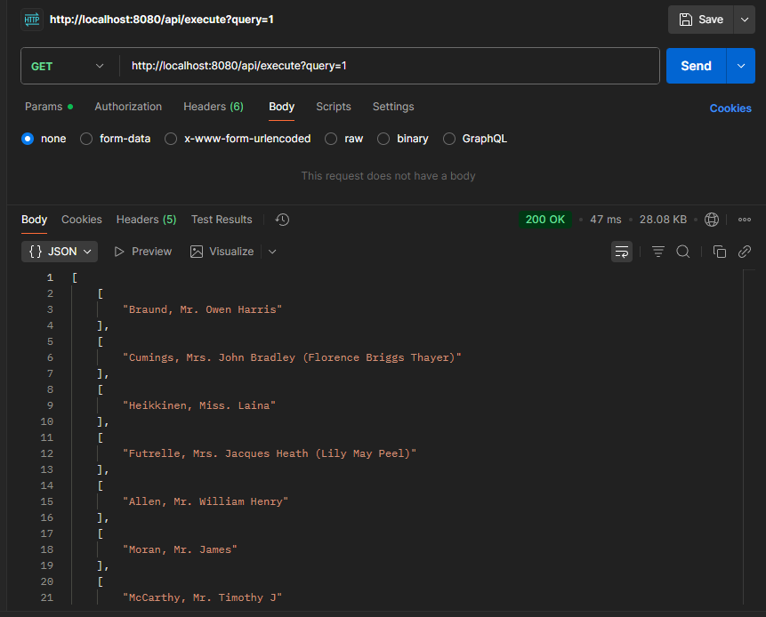
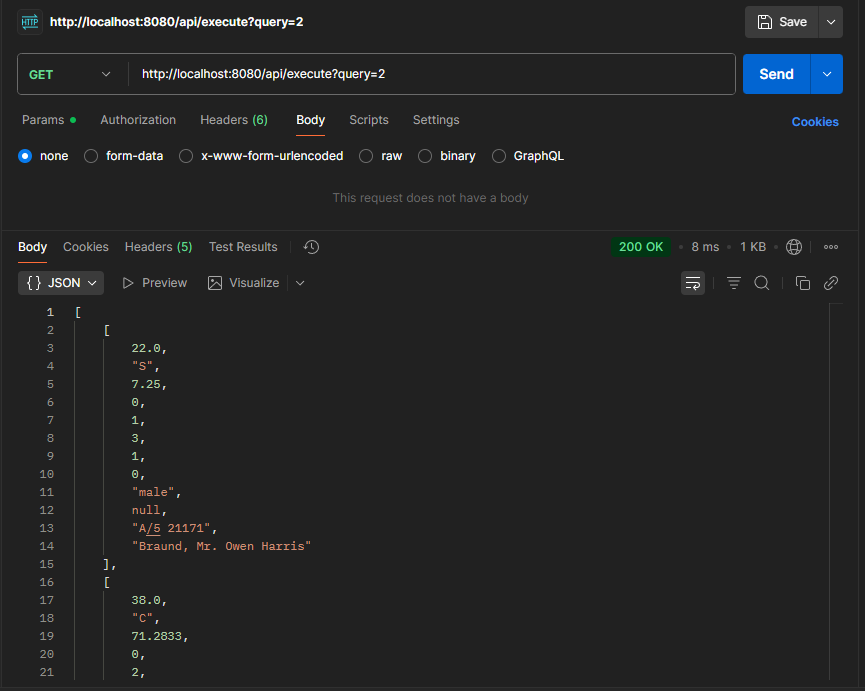
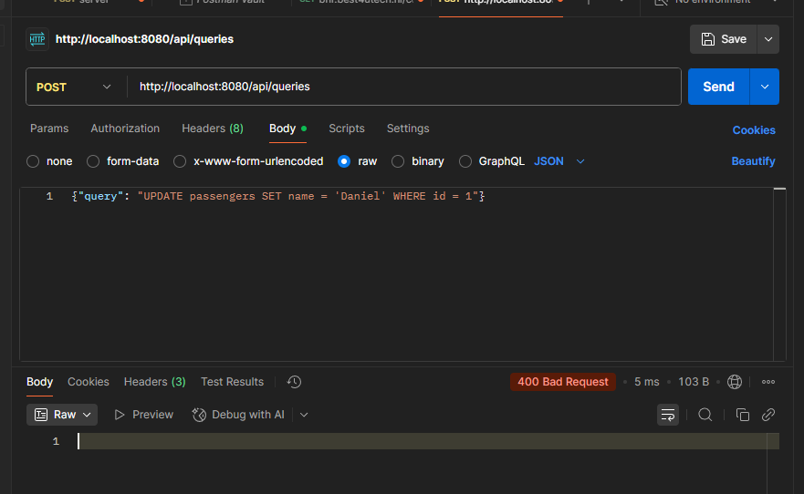

# SQL Query Management API

This project is a Spring Boot REST API for managing and executing SQL queries on a sample Titanic passengers dataset.  
It demonstrates secure, read-only query execution and clean API design.  
The application uses an in-memory H2 database and can be tested easily with Postman.

---

## Overview

The API allows users to store SQL queries, list them, and execute them on demand.  
It is useful for analytical dashboards or data exploration tools where you need to execute predefined queries safely without risking data modification.

The backend uses Spring Boot and H2, with a validation layer to ensure that only safe `SELECT` queries are allowed.  
Queries like `UPDATE`, `DELETE`, `INSERT`, or `DROP` are automatically rejected for safety.

---
**Task Requirements Implemented:**
- POST `/api/queries` - Store queries with body containing SQL text, returns `{"id": 1}`
- GET `/api/queries` - List all queries returning IDs and query texts
- GET `/api/execute?query=1` - Execute queries returning results as 2D arrays

**Bonus Features:**
- Data safety guarantee through read-only connections
- Performance optimization via caching (data never changes)
- Integration tests covering full workflow (add → list → execute)

---

## Features

- Store SQL queries for later use  
- List all saved queries with their IDs  
- Execute saved queries and view results  
- Security layer blocks unsafe SQL commands  
- Read-only database mode to protect data  
- Preloaded Titanic dataset for demonstration  
- Works directly with Postman for easy testing  

---

## API Workflow

### 1. Creating a Query

You can create a new query through a POST request.  
This saves the query to the database for future use.

**Screenshot:**  



---

### 2. Listing All Queries

You can fetch a list of all stored queries using a GET request.  
Each query is returned with its unique ID and SQL text.

**Screenshot:**  


---

### 3. Executing a Query

To run a query, send a GET request with the query ID as a parameter.  
The system executes the SQL and returns the results as JSON.

**Screenshot:**  


---

### 4. Viewing Detailed Results

You can also run more complex queries, like selecting all columns from the passengers table, to view the full dataset.

**Screenshot:**

---

### 5. Security Example

If you try to submit a query that modifies data (like `UPDATE` or `DELETE`), the system will block it automatically and return a 400 Bad Request response.

**Screenshot:**

---

## Architecture

The system follows a layered architecture:

- Controller layer handles API requests  
- Service layer manages validation and caching  
- Repository layer interacts with the H2 database  

The database is initialized with the Titanic passengers dataset, and all queries are executed in read-only mode.

---

## Technologies Used

- Java 17  
- Spring Boot 3  
- H2 Database  
- Spring Data JPA  
- Postman for API testing  
- Maven for build and dependency management  

---

## How It Works

1. **Start the Spring Boot application:**  
   ```bash
   cd analytics-backend
   mvn spring-boot:run
   ```
2. Use Postman to send requests to `http://localhost:8080/api`.  
3. Add queries, list them, and execute by ID.  
4. All results are returned as JSON arrays (2D format as required).  
5. Unsafe queries are blocked before reaching the database.

---

## Example Dataset

The included dataset is based on Titanic passenger data.  
It contains details such as name, age, gender, class, fare, and survival status.  
This makes it ideal for running analytical queries and group-based data summaries.

---

## H2 Console Access

You can view the database in your browser at:  
`http://localhost:8080/h2-console`

Use the following credentials:

- JDBC URL: `jdbc:h2:mem:analytics`  
- Username: `sa`  
- Password: `password`

---

## Notes

- The database is in-memory and resets when the application restarts.  
- Queries are cached for faster execution.  
- The API is designed for read-only analytics and not for production data modification.  
- Screenshots show working examples tested in Postman.

---
